<p align="center">
  
</p>

<h1 align="center">AVSOPS Brand & Style Guide</h1>
<p align="center">
  <strong>American Veterans Service Organizations & Patriotic Societies</strong><br>
  A 501(c)(3) Nonprofit Open Data Initiative<br>
  <a href="https://avsops.com">avsops.com</a>
</p>

---

## Table of Contents

- [The Logo](#the-logo)
- [The Coat of Arms](#the-coat-of-arms)
- [Color Palette](#color-palette)
- [Typography](#typography)
- [Logo Assets](#logo-assets)
- [War Period Icons](#war-period-icons)
- [Wallpapers](#wallpapers)
- [Usage Guidelines](#usage-guidelines)
- [Downloads](#downloads)

---

## The Logo

<p align="center">
  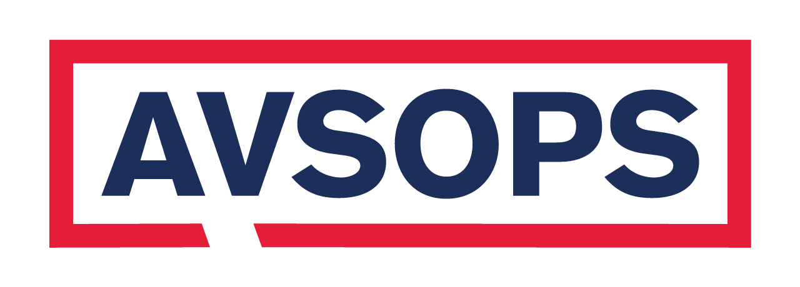
</p>

### The Story Behind the Design

In the landscape of veteran support and patriotic organizations, many voices can sometimes diffuse a common message. AVSOPS was founded with a clear vision: to create a centralized, clear-sounding voice that coordinates the efforts of numerous veteran service organizations and patriotic societies across the country. Our logo is not just a mark — it is a visual distillation of that founding purpose.

Every element, from the shape to the specific colors chosen, was deliberate, serving as a constant reminder of our dual identity as a service organization and a patriotic shield.

### The Architecture: A "Shield-Bubble"

The most prominent feature of our logo is its perimeter — a bold red rectangle with a distinctive pointer tail. This shape is a carefully designed fusion of two concepts: **the traditional shield** and **the modern speech bubble**.

**Unity and Clarity (The Speech Bubble):** At its core, AVSOPS is a communication hub. The organization was built to synthesize the complex, sometimes fragmented needs of various groups into a single, unified message. The speech bubble represents that central, powerful "Voice of Service." The point is directed outwards, indicating we are the primary conduit through which our members' messages are articulated to policymakers and the public.

**Protection and Defense (The Shield):** In traditional heraldry and military design, the rectangle is a foundational "field." By squaring it off and outlining it boldly, it functions as a visual shield. AVSOPS provides a protective structure for the various patriotic societies and smaller service organizations within its network — administratively, legally, and in advocacy — allowing them to focus on their core mission of serving veterans.

### Logo Variants

| Variant | Preview | File |
|---------|---------|------|
| Primary (White Background) |  | `logos/png/avsops-logo.png` |
| Red-White-Blue |  | `logos/png/avsops-rwb-logo.png` |
| Favicon / Social | 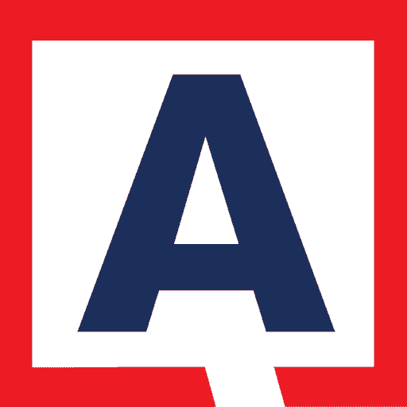 | `logos/png/avsops-favicon-512x512.png` |
| SVG (Vector) | — | `logos/svg/avsops-logo.svg` |
| SVG Color Variant | — | `logos/svg/avsops-logo-color.svg` |

---

## The Coat of Arms

<p align="center">
  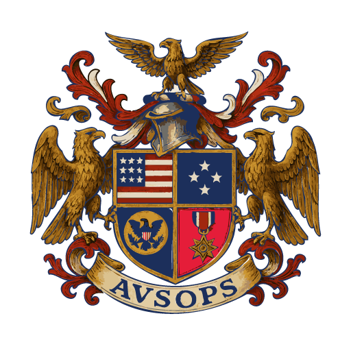
</p>

### The Official Blazon

In formal heraldry, a **Blazon** is the technical, written description of a coat of arms. It uses a specific language (a mix of Old French and English) so that any heraldic artist in the world can recreate the shield accurately from the text alone.

#### The Shield (Escutcheon)

**Quarterly:**

1. **First:** Gules (Red), five bars Argent (White); on a canton Azure (Blue), nine mullets Argent arranged three, three, and three
2. **Second:** Azure, four mullets Argent in cross
3. **Third:** Azure, an American Bald Eagle displayed Or (Gold), charged on the breast with a shield of the United States and grasping in its talons an olive branch and thirteen arrows
4. **Fourth:** Gules, a representation of a Star of Valor Or, suspended from a ribbon Gules fimbriated Argent

*The whole Shield is bordered Or.*

#### The Crest

Upon a wreath of the colors, a Steel Sallet helmet proper, mantled Gules doubled Or. Above the helmet, an American Bald Eagle displayed Or, perched upon a torse.

#### The Supporters

Two American Bald Eagles Or, wings elevated and addorsed, standing upon the compartment.

#### The Motto

On a scroll Or beneath the shield, the letters **AVSOPS** in Azure.

### Heraldic Terms Key

| Term | Meaning |
|------|---------|
| **Quarterly** | Shield divided into four sections (diversity of missions) |
| **Or** | Gold (represented as yellow) |
| **Argent** | Silver (represented as white) |
| **Gules** | Red |
| **Azure** | Blue |
| **Mullets** | Five-pointed stars |
| **Displayed** | Wings spread wide |
| **Proper** | Shown in natural, realistic colors |
| **Fimbriated** | Bordered or edged |
| **Torse** | Twisted wreath beneath the crest |
| **Addorsed** | Back to back |

#### Coat of Arms Files

| Format | File |
|--------|------|
| PNG (512x512) | `logos/png/avsops-coat-of-arms-512x512.png` |
| SVG (Vector) | `logos/svg/avsops-coat-of-arms.svg` |

---

## Color Palette

The colors of AVSOPS were selected not just for aesthetic appeal, but for their direct historical and emotional ties to the service members we represent. We chose to move away from brighter, "ceremonial" colors toward something more functional and grounded.

### Primary Brand Colors

<table>
  <tr>
    <td align="center"><br><strong>Deep Navy Blue</strong><br><code>#1C2F5B</code></td>
    <td align="center"><br><strong>Bold Patriot Red</strong><br><code>#E51D39</code></td>
    <td align="center"><br><strong>Pure Gold</strong><br><code>#FFD700</code></td>
    <td align="center"><br><strong>Yellow-Mustard</strong><br><code>#FFCD57</code></td>
    <td align="center"><br><strong>Grey Border</strong><br><code>#67768E</code></td>
  </tr>
</table>

### Color Meanings

| Color | Hex | CSS Variable | Meaning & Usage |
|-------|-----|-------------|-----------------|
| **Deep Navy Blue** | `#1C2F5B` | `--color-navy` | Service, integrity, and profound duty. The color of the deep oceans and the steadfast uniforms of our naval forces. Used for primary text, headers, and backgrounds. |
| **Bold Patriot Red** | `#E51D39` | `--color-red` | Patriotism in action and unflagging energy. Represents the lifeblood of the organization — the active, relentless spirit required to advocate day after day. Used for the logo enclosure, accents, and alerts. |
| **Pure Gold** | `#FFD700` | `--color-gold` | Achievement, valor, and emphasis. Used for highlights, badges, and honor indicators. |
| **Yellow-Mustard** | `#FFCD57` | `--color-mustard` | Warmth and accessibility. Used for buttons and secondary interactive elements. |
| **Grey Border** | `#67768E` | — | Structure and order. Used for borders, dividers, and subtle UI elements. |
| **Pure White** | `#FFFFFF` | — | Transparency, objectivity, and hope. The field of clarity on which our message rests. |

### Extended Palette

| Color | Hex | CSS Variable | Usage |
|-------|-----|-------------|-------|
| Navy Light | `#2a4275` | `--color-navy-light` | Lighter navy variant |
| Navy Dark | `#0a1628` | `--color-navy-dark` | Deep backgrounds, footer |
| Red Dark | `#b8162e` | `--color-red-dark` | Hover states |
| Gold Light | `#ffe033` | `--color-gold-light` | Light gold variant |
| Gold Dark | `#c9a227` | `--color-gold-dark` | Link hover states |
| Mustard Dark | `#e6b84d` | `--color-mustard-dark` | Button hover states |
| Off-White | `#f5f4f1` | `--color-off-white` | Page backgrounds |
| Warm White | `#faf9f7` | `--color-white` | Card backgrounds |
| Light Gray | `#e8e6e1` | `--color-gray-light` | Subtle borders |
| Mid Gray | `#6c757d` | `--color-gray` | Secondary text |
| Dark Gray | `#343a40` | `--color-gray-dark` | Body text |
| Near Black | `#1a1a1a` | `--color-black` | Maximum contrast |

### Functional Colors

| Color | Hex | CSS Variable | Usage |
|-------|-----|-------------|-------|
| Success | `#28a745` | `--color-success` | Confirmations, positive actions |
| Warning | `#ffc107` | `--color-warning` | Caution indicators |
| Error | `#dc3545` | `--color-error` | Error states, destructive actions |
| Info | `#17a2b8` | `--color-info` | Informational messages |

### CSS Import

The complete palette is available as a CSS custom properties file:

```css
/* Import via: */
@import url('colors/avsops-palette.css');

/* Usage: */
.header { background-color: var(--color-navy); }
.accent { color: var(--color-red); }
.highlight { color: var(--color-gold); }
.button { background-color: var(--color-mustard); }
```

See [`colors/avsops-palette.css`](colors/avsops-palette.css) for the full file.

---

## Typography

### Headings — Merriweather


**Font:** [Merriweather](https://fonts.google.com/specimen/Merriweather) (Serif)

Used for all headings, titles, and display text. Merriweather's strong serifs convey authority and tradition — qualities essential to a veteran service organization.

```css
font-family: 'Merriweather', Georgia, serif;
```

### Body — Open Sans

**Font:** [Open Sans](https://fonts.google.com/specimen/Open+Sans) (Sans-serif)

Used for body text, navigation, buttons, and UI elements. Open Sans provides excellent readability at all sizes with a clean, modern feel.

```css
font-family: 'Open Sans', -apple-system, BlinkMacSystemFont, 'Segoe UI', Roboto, sans-serif;
```

### Google Fonts Import

```html
<link rel="preconnect" href="https://fonts.googleapis.com">
<link rel="preconnect" href="https://fonts.gstatic.com" crossorigin>
<link href="https://fonts.googleapis.com/css2?family=Merriweather:wght@400;700;900&family=Open+Sans:wght@400;600;700&display=swap" rel="stylesheet">
```

---

## Logo Assets

All logos are organized by format:

### Vector (SVG)

| File | Description |
|------|-------------|
| [`logos/svg/avsops-logo.svg`](logos/svg/avsops-logo.svg) | Primary logo (white variant) |
| [`logos/svg/avsops-logo-color.svg`](logos/svg/avsops-logo-color.svg) | Primary logo (color variant) |
| [`logos/svg/avsops-coat-of-arms.svg`](logos/svg/avsops-coat-of-arms.svg) | Coat of Arms (full detail) |

### Raster (PNG)

| File | Dimensions | Description |
|------|-----------|-------------|
| [`logos/png/avsops-logo.png`](logos/png/avsops-logo.png) | Standard | Primary logo |
| [`logos/png/avsops-rwb-logo.png`](logos/png/avsops-rwb-logo.png) | Standard | Red-White-Blue variant |
| [`logos/png/avsops-coat-of-arms-512x512.png`](logos/png/avsops-coat-of-arms-512x512.png) | 512x512 | Coat of Arms |
| [`logos/png/avsops-favicon-512x512.png`](logos/png/avsops-favicon-512x512.png) | 512x512 | Favicon / Social media icon |
| [`logos/png/avsops-hero-layered.png`](logos/png/avsops-hero-layered.png) | Large | Hero banner (layered composition) |

---

## War Period Icons

AVSOPS catalogs veteran organizations spanning 11 American war periods. Each has a distinctive 512x512 icon:

| Icon | War Period | Icon | War Period |
|:----:|:-----------|:----:|:-----------|
| 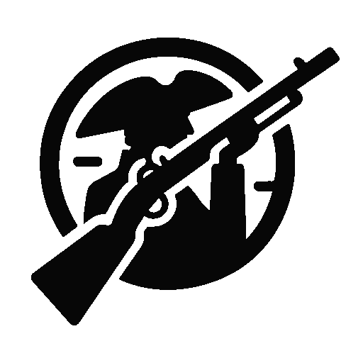 | **American Revolution** | 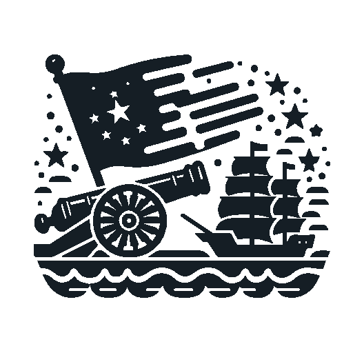 | **War of 1812** |
| 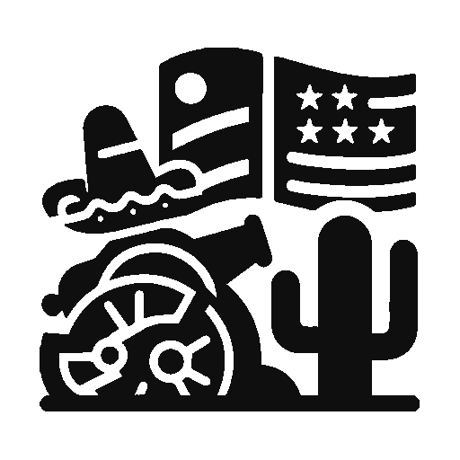 | **Mexican-American War** | 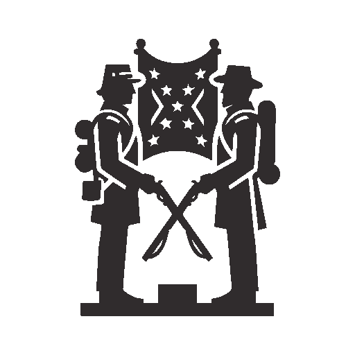 | **Civil War** |
| 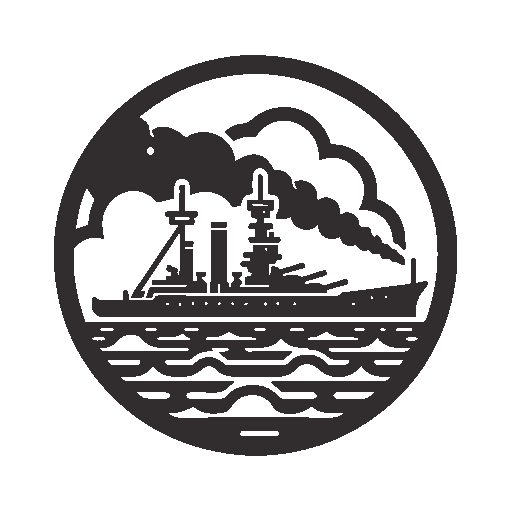 | **Spanish-American War** | 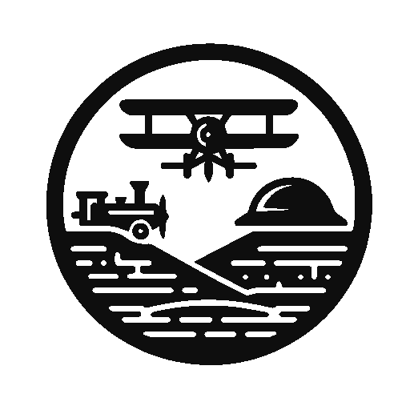 | **World War I** |
| 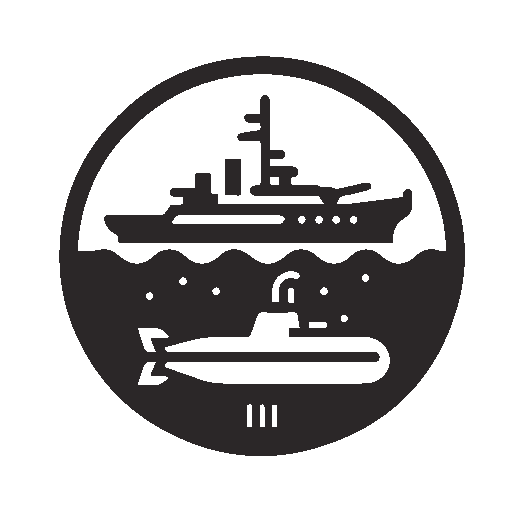 | **World War II** | 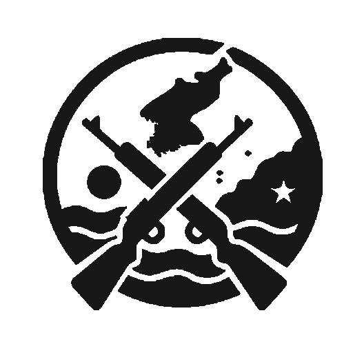 | **Korean War** |
| 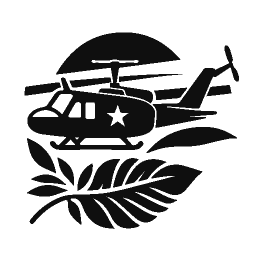 | **Vietnam War** | 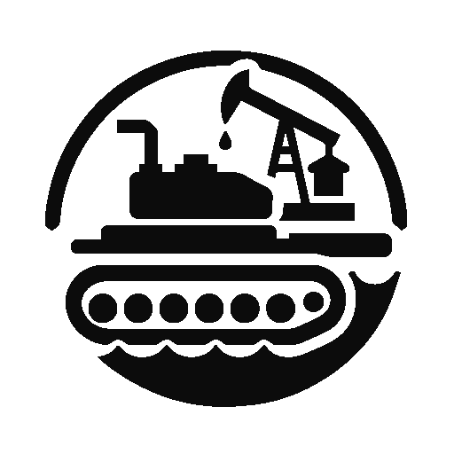 | **Gulf War** |
| 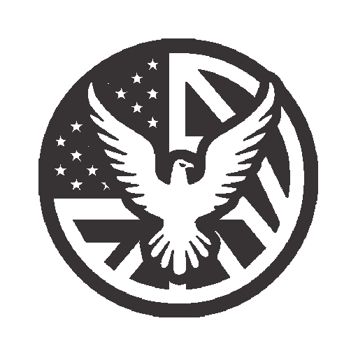 | **War on Terror** | | |

All icons are located in [`war-icons/`](war-icons/) at 512x512 PNG resolution.

---

## Wallpapers

Desktop and mobile wallpapers featuring the AVSOPS brand identity over a digital binary code motif.

### Desktop

<table>
  <tr>
    <td align="center">
      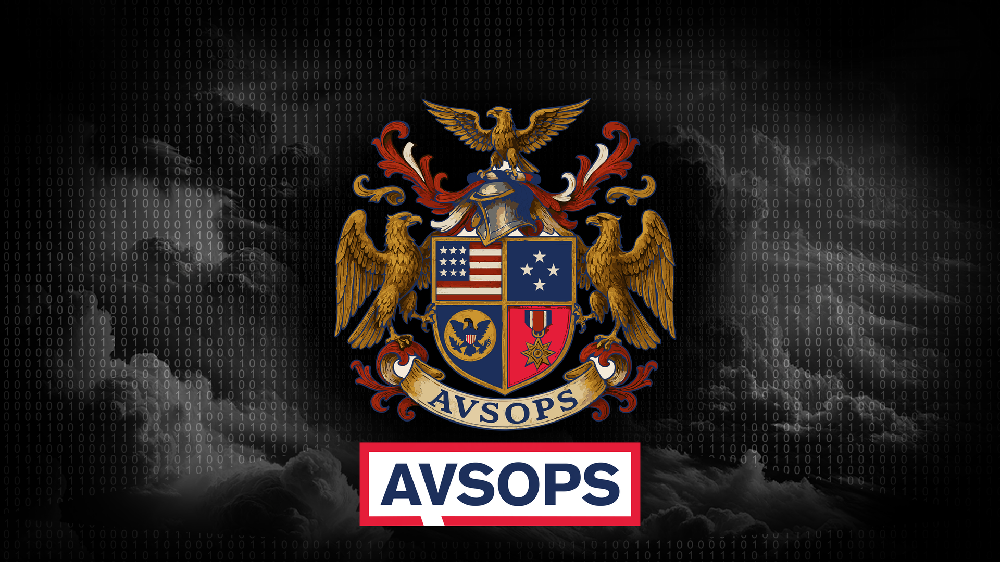<br>
      <sub><strong>AVSOPS Logo</strong></sub><br>
      <sub><a href="wallpapers/desktop/avsops-logo-binary-1920x1080.png">1920x1080</a> · <a href="wallpapers/desktop/avsops-logo-binary-2560x1440.png">2560x1440</a> · <a href="wallpapers/desktop/avsops-logo-binary-5120x2880.png">5120x2880 (5K)</a></sub>
    </td>
    <td align="center">
      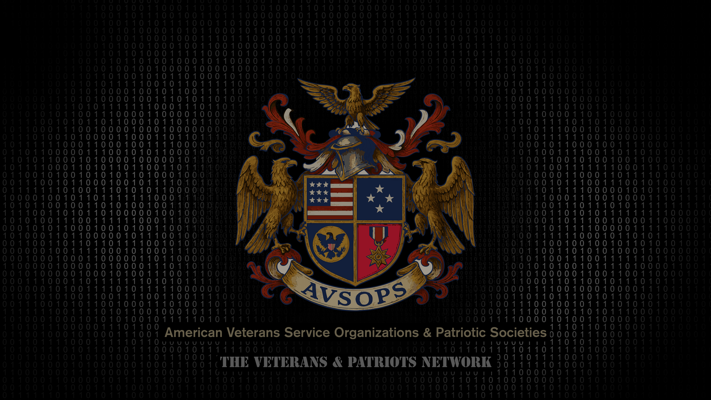<br>
      <sub><strong>Coat of Arms</strong></sub><br>
      <sub><a href="wallpapers/desktop/avsops-coat-of-arms-binary-1920x1080.png">1920x1080</a> · <a href="wallpapers/desktop/avsops-coat-of-arms-binary-2560x1440.png">2560x1440</a> · <a href="wallpapers/desktop/avsops-coat-of-arms-binary-5120x2880.png">5120x2880 (5K)</a></sub>
    </td>
  </tr>
</table>

### Mobile

<table>
  <tr>
    <td align="center">
      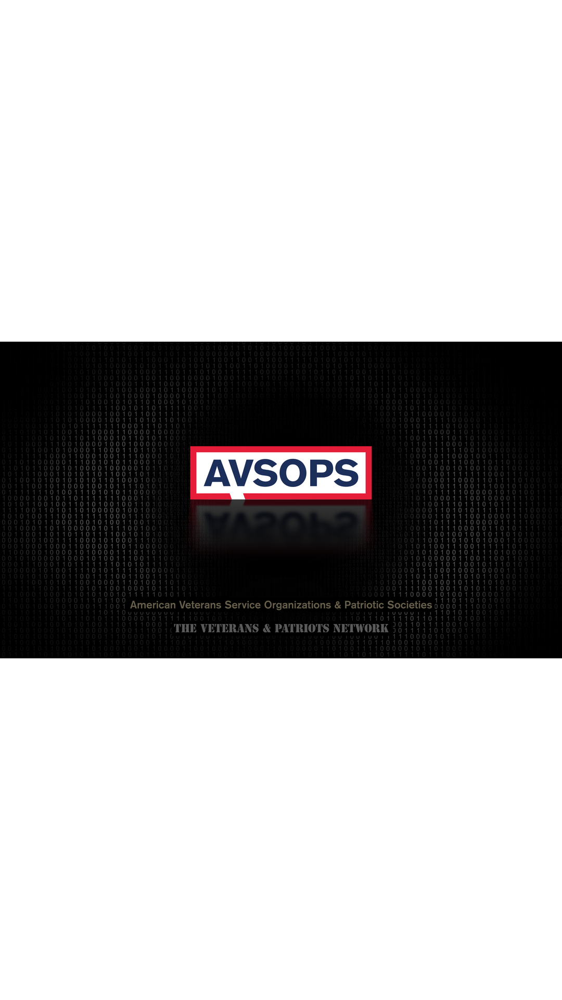<br>
      <sub><strong>Logo</strong> · 1080x1920</sub>
    </td>
    <td align="center">
      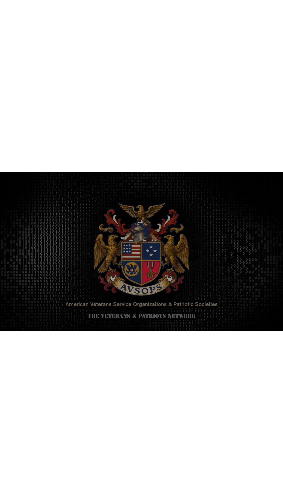<br>
      <sub><strong>Coat of Arms</strong> · 1080x1920</sub>
    </td>
  </tr>
</table>

---

## Usage Guidelines

### Do

- Use the logo on white, off-white, or dark navy backgrounds
- Maintain the aspect ratio when scaling
- Use SVG format whenever possible for sharp rendering at any size
- Reference the official hex values from this guide

### Don't

- Stretch, skew, or distort the logo
- Change the brand colors
- Place the logo on busy or low-contrast backgrounds
- Recreate or modify the Coat of Arms — use the official files
- Add effects (drop shadows, gradients, outlines) to the logo

### Minimum Size

- **Logo:** 96px wide minimum for digital use
- **Favicon:** 32x32 minimum, 512x512 recommended
- **Coat of Arms:** 128px wide minimum (detail is important)

### Clear Space

Maintain a minimum clear space around the logo equal to the height of the letter "A" in AVSOPS.

---

## Downloads

| Asset | Format | Link |
|-------|--------|------|
| Full Logo Pack | SVG + PNG | [`logos/`](logos/) |
| Coat of Arms | SVG + PNG | [`logos/svg/avsops-coat-of-arms.svg`](logos/svg/avsops-coat-of-arms.svg) |
| Color Palette | CSS | [`colors/avsops-palette.css`](colors/avsops-palette.css) |
| War Period Icons | PNG (512x512) | [`war-icons/`](war-icons/) |
| Desktop Wallpapers | PNG (1080p–5K) | [`wallpapers/desktop/`](wallpapers/desktop/) |
| Mobile Wallpapers | PNG (1080x1920) | [`wallpapers/mobile/`](wallpapers/mobile/) |

---

## About AVSOPS

**AVSOPS Inc.** is a Virginia nonprofit corporation and 501(c)(3) public charity dedicated to collecting and publishing open data on veteran service organizations across all 50 states.

- **Website:** [avsops.com](https://avsops.com)
- **Open Data:** [github.com/AVSOPS](https://github.com/AVSOPS)
- **Founded by:** Edwin Lothair Arnold Jr.
- **Location:** Alexandria, Virginia

Technology & development by [IMPAXSYS](https://impaxsys.com).

---

<p align="center">
  <em>From American Revolution-era patriotic societies to post-9/11 groups — every organization, every county, free and open.</em>
</p>
